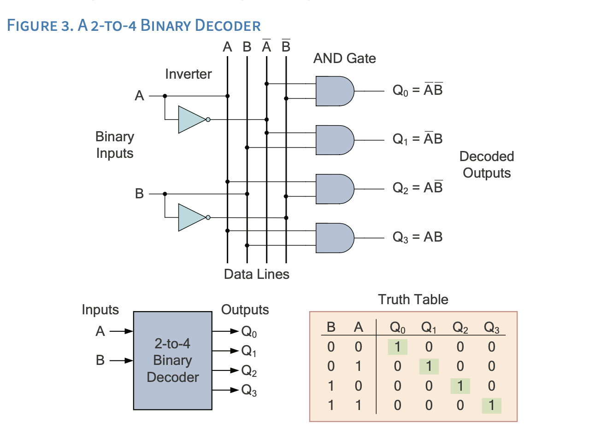
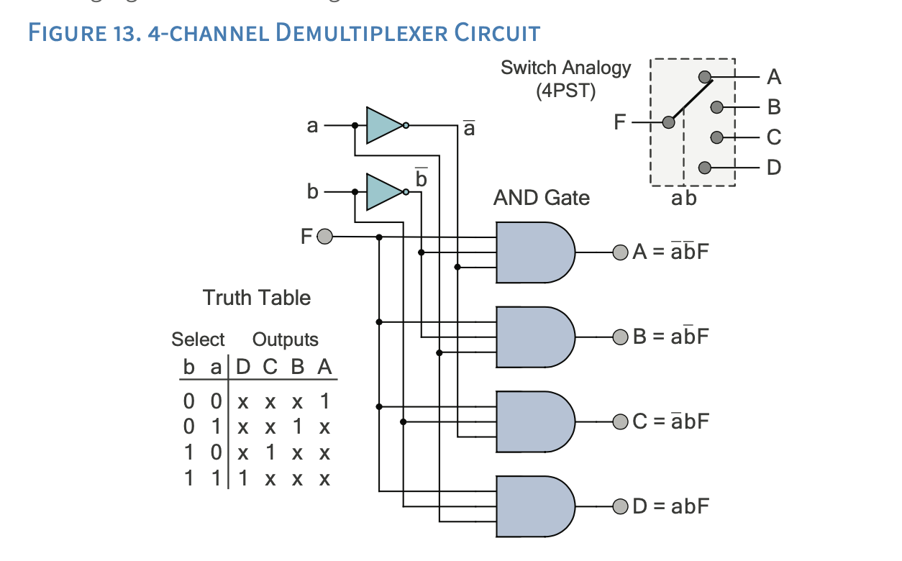
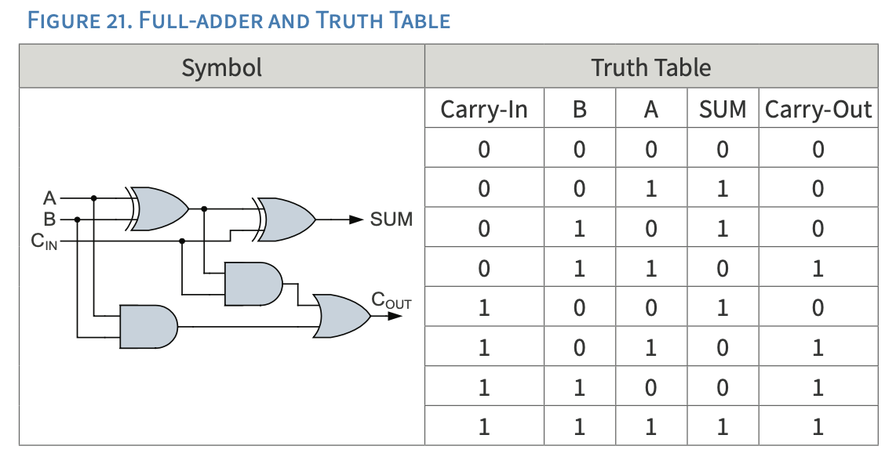
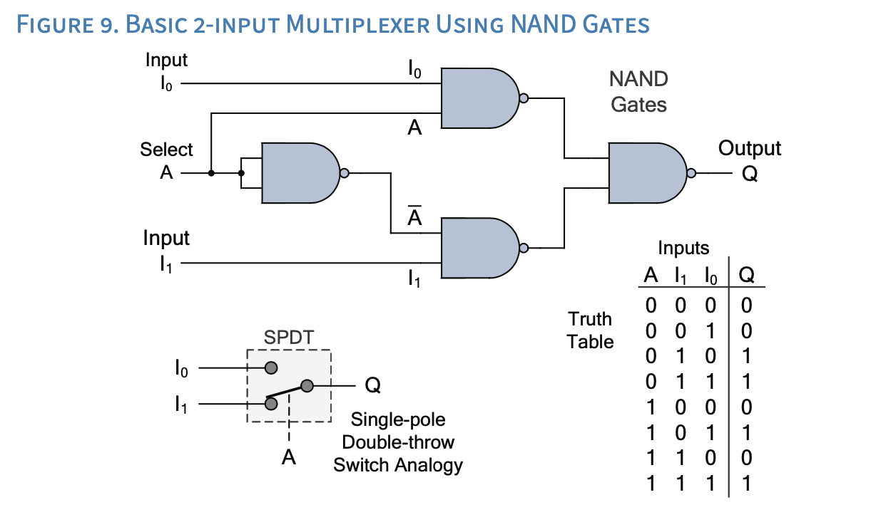

## Combination Logic
Solve these problems in the Digital Logic Simulator, they will require a bit more work. Be sure to understand both the image and the description.

### 2 input Decoder for Selecting a Memory Cell
#### Memory Structure:
- **4 memory cells** (words)
- **2 address lines** (inputs) needed to select one of the four cells
- The **2:4 decoder** converts these 2 inputs into 4 select lines [^1]

The addressing works as follows:

#### Input Address Lines → Output Selected Cell
- 00 → Cell 0
- 01 → Cell 1
- 10 → Cell 2
- 11 → Cell 3

The decoder takes these 2 binary inputs and activates one of four output lines to select the corresponding memory word. This setup is more efficient than using individual select lines for each memory cell, as it reduces the number of control signals needed from N (number of words) to log₂N.



```

Paste screenshot here

```

<div style="page-break-after: always;"></div>

### 1 to 4 Demultiplexer

### A 1-to-4 demultiplexer (DEMUX) is a device that:
* Takes one input data line (*F*)
* Uses two select lines (*a* and *b*)
* Distributes the input to one of four output lines (**A** through **D**) 

#### The demultiplexer functions by:

* Receiving a single data input signal
* Using the select lines to determine which output channel to activate
* Switching the input data to the selected output line while keeping other outputs inactive 

#### Here's how it works in practice:

You have an appliance which may perform 4 different functions, however, you only want one of these functions to happen at once. 

* The input signal (*F*) could be button on a panel of a appliance
* The two select lines (*a* and *b*) could be switches that determine which output receives the input signal
* This reduces the number of buttons to press and ensures only one function is selected at a time



```

Paste screenshot here

```


<div style="page-break-after: always;"></div>

### Full Adder 2-bit
#### Description
A **2-bit full adder** can be used to create a basic counter which could serve as a simple program counter.

1. The **2-bit full adder** can count from 0 to 3 (00 to 11 in binary)

2. To create a simple program counter:
   - Initial state starts at 00
   - One input is permanently set to 1 (01)
   - Each clock cycle, the sum output is fed back as the other input
   - The carry output can be used to detect overflow

The counting sequence would be:
```
Initial state: 00
After 1st cycle: 01  (00 + 01)
After 2nd cycle: 10  (01 + 01)
After 3rd cycle: 11  (10 + 01)
After 4th cycle: 00  (11 + 01, with overflow)
```

This creates a simple modulo-4 counter that continuously cycles through these values, which can be used for basic program sequencing or timing purposes. The carry output (overflow) can be used to trigger other circuit elements or to indicate when a full cycle has completed.

One could take this program counter and add the *2 to 4 Decoder* and have a very simple state machine.



```

Paste screenshot here

```


<div style="page-break-after: always;"></div>

### 2-input multiplexer
#### Description
A **2-input multiplexer** (also called a **2:1 mux**) is like a digital switch that selects between two input signals based on a selection line. Here's a basic example:

#### Here's how it works:
- When **A** (selection line) is **0**, the output will be whatever value is on input **I0**
- When **A** is **1**, the output will be whatever value is on input **I1**

#### Application
A common practical application would be selecting between two different clock sources. Assume you only have a 16-bit counter, which means at 1MHz (*1 tick per usec, one million ticks per second*), you can count 65,535 ticks or .065 seconds. However, if you had two clocks, high-speed at 1MHz and low speed at 1kHz (1000 ticks per second), you could have both a high precision timer and a long timer, up to 1 minute and 5.53 seconds.:



```

Paste screenshot here

```
